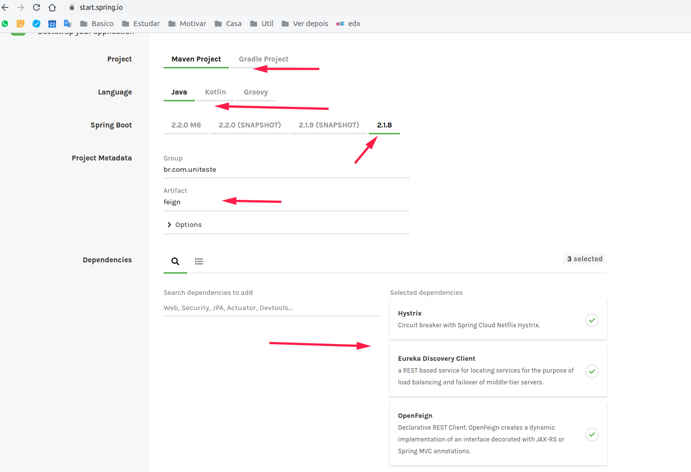
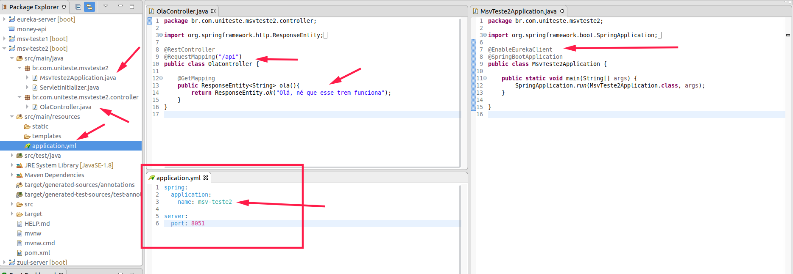
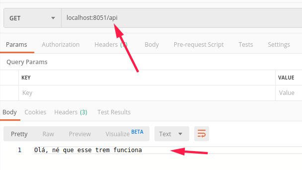
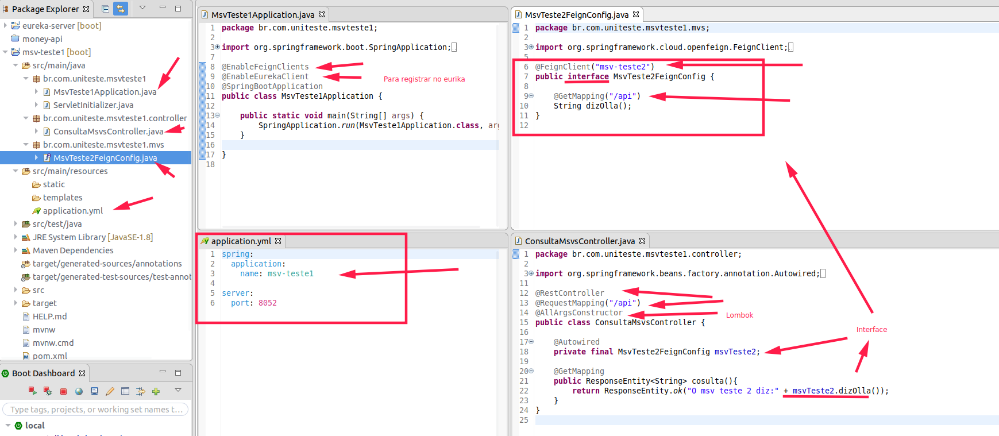
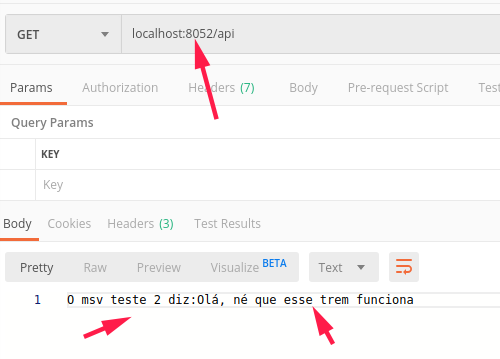
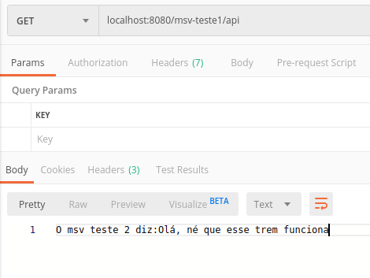
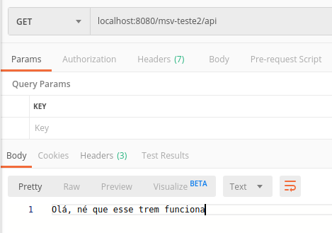
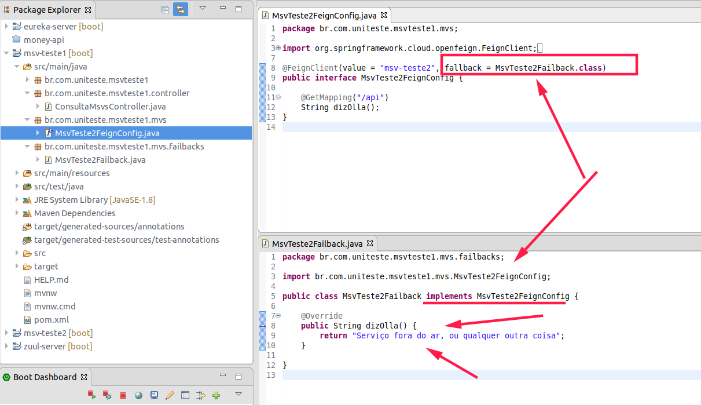

03 - Spring Cloud Feign


### Inatalando um projeto basico



------
------

### Testando

Para testar crei dois microserviços
- um que tem uma api exporta
- um que consome essa api através do **Feign**

1. **O que exporta uma api**



- Postman

```
localhost:8051/api
```



------

2. **O que consome a api criada anteriomente**




- Postman

```
localhost:8052/api
```




------

3. Usando o Zuul para realizar a chamada

Caso nao tenha configurado o zuul veja:

[02 - Spring Cloud Zuul](:/1b05b5e836ed4ca8ae4b4fc734a0c37c)

- Postman

**msv-teste1**

```
localhost:8080/msv-teste1/api
```



**msv-teste2**
```
localhost:8080/msv-teste2/api
```




### Implementando failback

Para implementar e so criar uma classe que implemente os metodos da interface do feign criada



Caso dê timeout o failback vai executar, isso pode ser util para retornar um dado de cache, ou dispara e-mail ou coisa do tipo.


